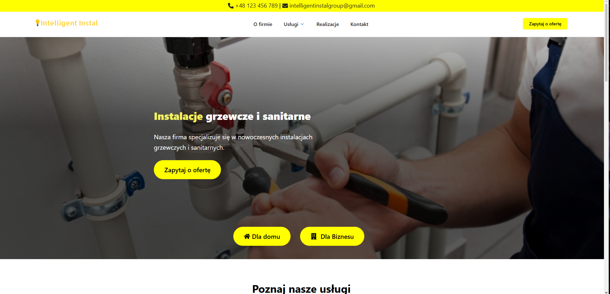
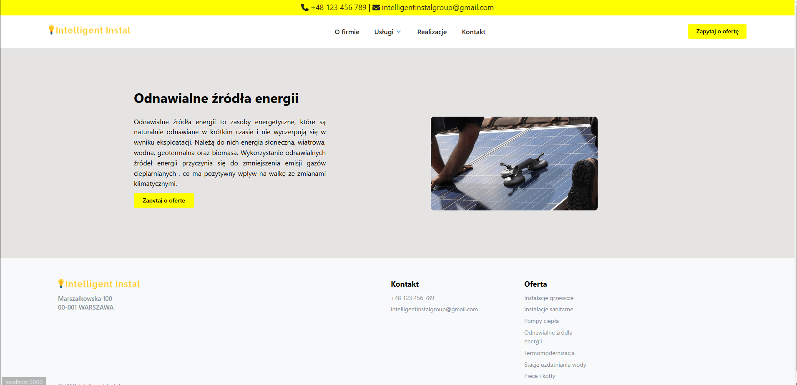

# IntelligentInstal

A modern website for an installation company specializing in heating systems, plumbing, and renewable energy solutions.

🔗 Live Demo: https://intelligent-instal.vercel.app

---

## 📌 About the Project

IntelligentInstal is a website designed to clearly present the company’s services and highlight its innovative and energy-efficient approach to modern installations.

---

## 🛠️ Tech Stack

- React

---

## 📸 Screenshots




---

## ⚙️ Installation

To run the project locally:

```bash
git clone https://github.com/your-username/intelligentinstal.git
cd ogrzewanie2
cd ogrzewanie2
npm install
npm run dev
